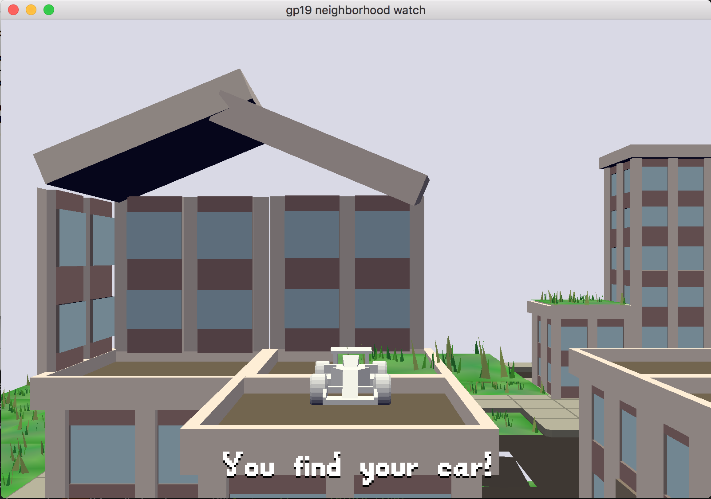

Find your car

Author: Xuechun Luo

Design: 

Explore the 3D scenes with your keyboard, follow the hints to find your car

Screen Shot:

How To Play:

The user uses the keyboard to take UP,DOWN,LEFT,RIGHT movement and follows the hints to find his car.

Sources:

Car Model from: https://kenney.nl/assets/racing-kit
Other Models from city.blend in this project

This game was built with [NEST](NEST.md).
